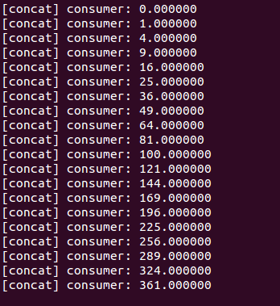
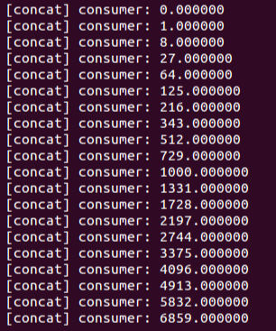
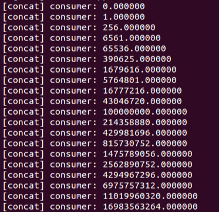
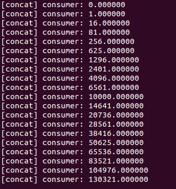

# DOL实例分析&编程


------

[TOC]


## 实验过程

### Example1: 

​	example1要用到的代码为square.c ，原代码如下：

```c
if (p->local->index < p->local->len) {
        DOL_read((void*)PORT_IN, &i, sizeof(float), p);
        i = i*i;
        DOL_write((void*)PORT_OUT, &i, sizeof(float), p);
        p->local->index++;
    }
```

分析原代码我们可以发现，每次进行square操作时，都对变量i进行了平方处理。根据题目要求，我们只需要改代码中i*i的部分，把平方改为立方，修改后的代码如下：

```c
if (p->local->index < p->local->len) {
        DOL_read((void*)PORT_IN, &i, sizeof(float), p);
        i = i*i*i;
        DOL_write((void*)PORT_OUT, &i, sizeof(float), p);
        p->local->index++;
    }
```


### Example2:

​	 example2的原代码如下：

```xml
<variable value="3" name="N"/>
```

```xml
 <!-- instantiate resources -->
  <process name="generator">
    <port type="output" name="10"/>
    <source type="c" location="generator.c"/>
  </process>

  <iterator variable="i" range="N">
    <process name="square">
      <append function="i"/>
      <port type="input" name="0"/>
      <port type="output" name="1"/>
      <source type="c" location="square.c"/>
    </process>
  </iterator>

  <process name="consumer">
    <port type="input" name="100"/>
    <source type="c" location="consumer.c"/>
  </process>

  <iterator variable="i" range="N + 1">
    <sw_channel type="fifo" size="10" name="C2">
      <append function="i"/>
      <port type="input" name="0"/>
      <port type="output" name="1"/>
    </sw_channel>
  </iterator>

```

分析上述原代码我们可以发现，函数通过迭代定义 3 个  square模块，具体对应为以下部分：

```xml
<variable value="3" name="N"/>
```

这其中value代表了迭代的次数，当前square模块的数目为两个，根据本次实验要求，我们要将 value的值改为2。修改后的代码如下：

```xml
<variable value="2" name="N"/>
```


## 实验结果

* example1 :
修改前：

修改后：



* example2 : 
修改前：

修改后：


##实验心得

本次实验没有遇到什么问题，都是按照ta给的ppt一步一步做的 。


