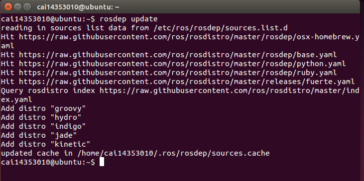

# ROS配置日志

-----------------------------

[TOC]

## ROS安装笔记

1.  配置软件库：
2.  设置软件源：sources.list：
    `sudo sh -c 'echo "deb http://packages.ros.org/ros/ubuntu $(lsb_release -sc) main" > /etc/apt/sources.list.d/ros-latest.list'`
3.  设置 keys：
    `sudo apt-key adv --keyserver hkp://ha.pool.sks-keyservers.net:80 --recv-key 0xB01FA116`
4.  安装：
* 更新软件：
  `sudo apt-get update`
* 完整安装桌面版ROS：
  `sudo apt-get install ros-kinetic-desktop-full`
5. 初始化 rosdep：
   `sudo rosdep init`
   `rosdep update`
   

6. 环境配置：
   ` echo "source /opt/ros/kinetic/setup.bash" >> ~/.bashrc`
   ` source ~/.bashrc`
7. 安装 rosinstall ：
`sudo apt-get install python-rosinstall`

## Experimental experience(实验心得)
配置过程完全就是按照ta给的博客来的，因此没有遇到什么问题。通过本次实验，我加深了对linux系统命令行的运用熟练程度。

